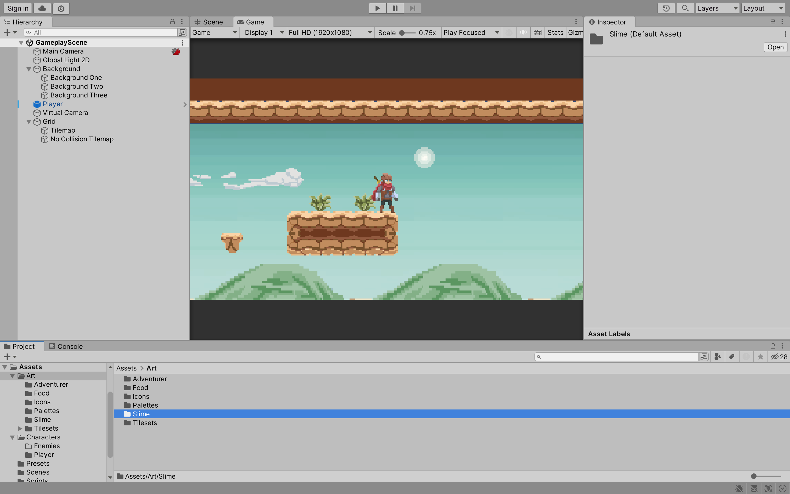
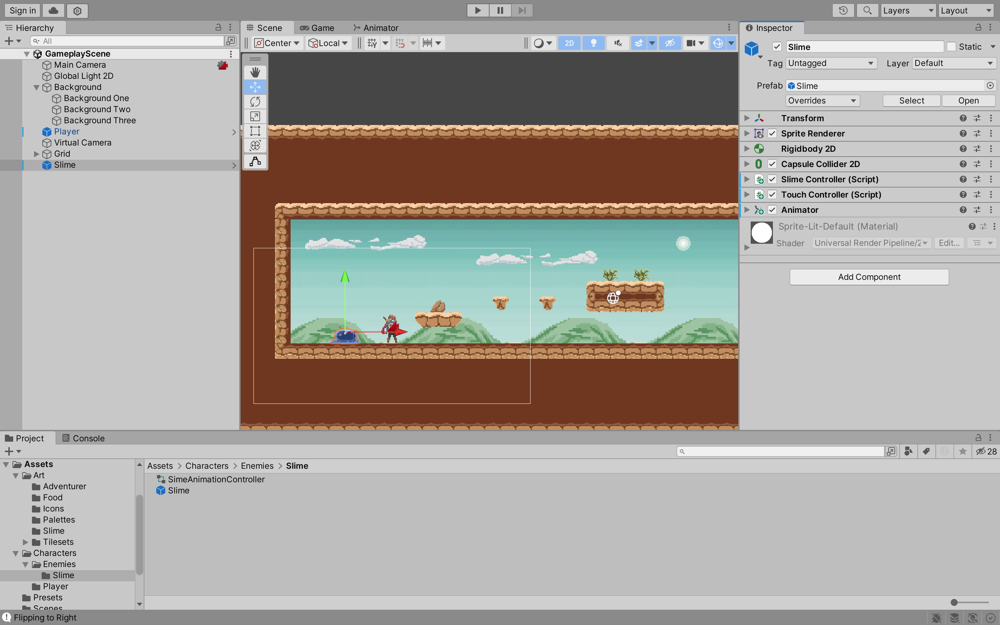
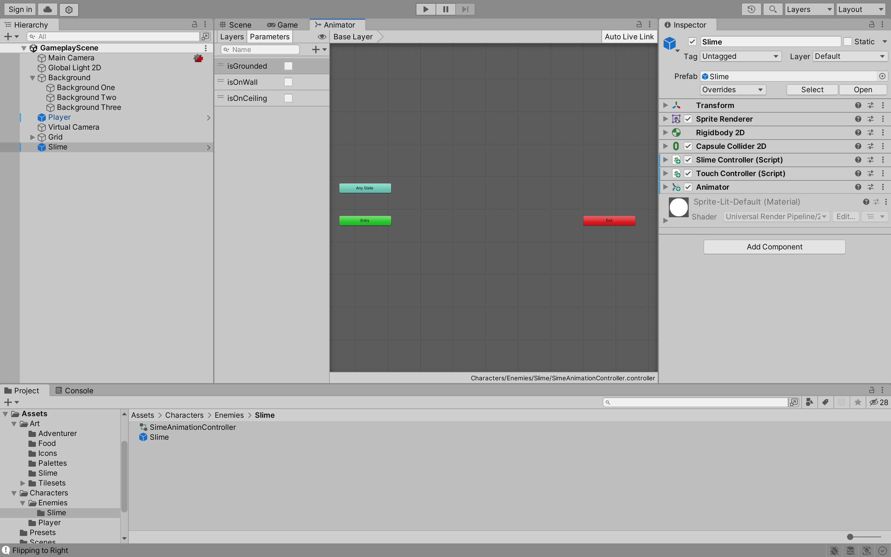
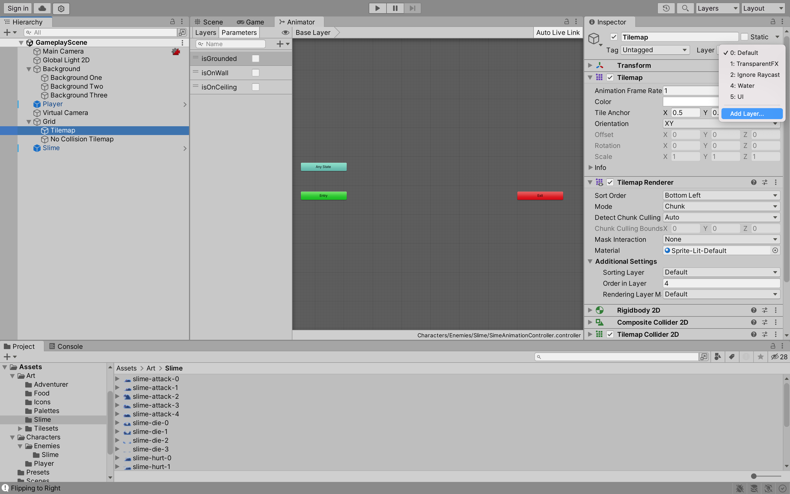
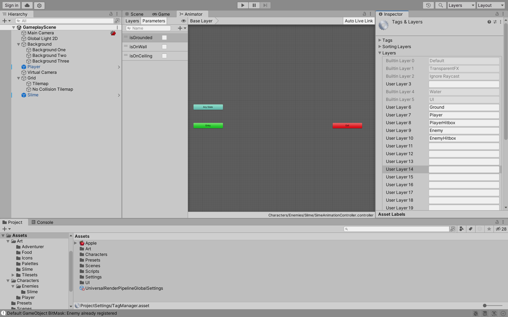
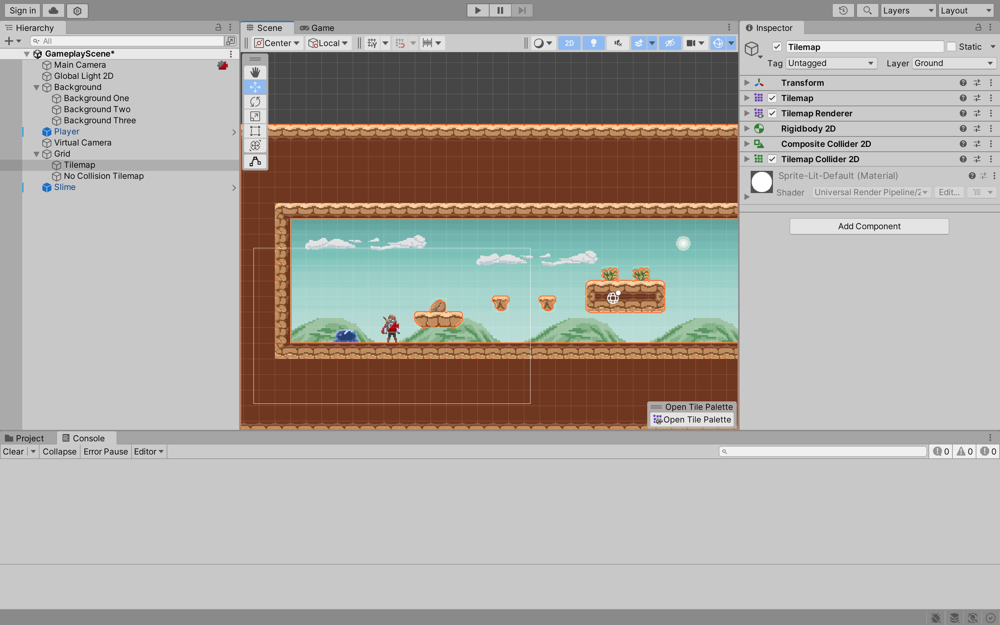
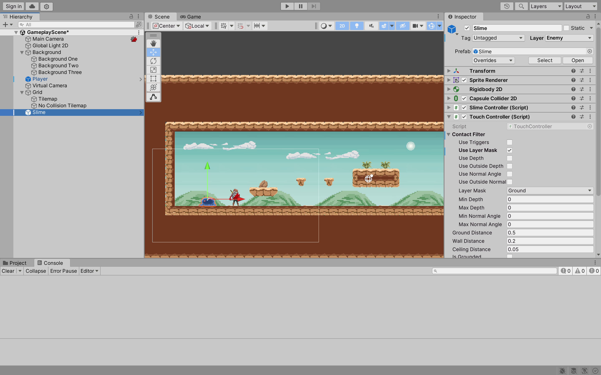
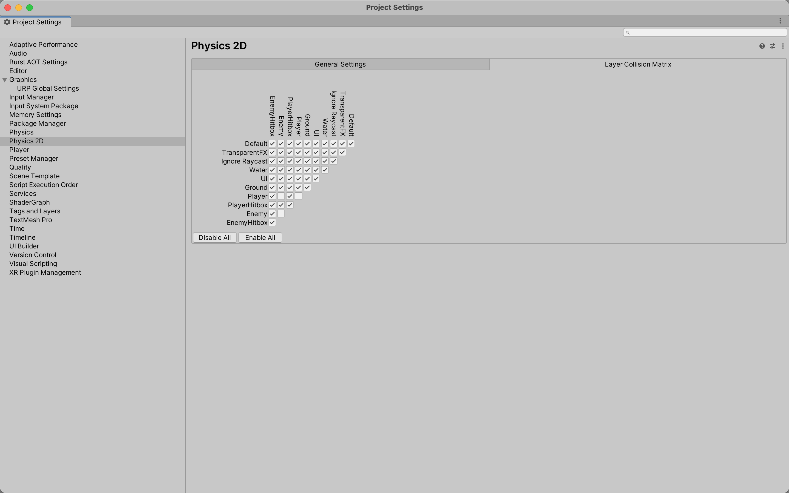

# 02: Unity Recap

## Enemy Walk

Now we are going to move onto the enemy. 

1. If you have not done this, drag and drop the **Slime** directory from the **assessments > project-game-development-demo > Art** directory into the **Assets > Art** directory.



2. The component configuration is similar to the player. Implement the following:
    - Create a new empty object and name it **Slime**.
    - Add a **Sprite Renderer** component and set the **Sprite** to **slide-idle-0**.
    - Add a **Rigidbody 2D** component and set the **Gravity Scale** to **1**.
    - Add a **Capsule Collider 2D** component and edit the collider to fit the sprite.
    - Add a new **Script** component and name it **SlimeController**. We will add code to this soon.
    - Add the **TouchController** script to the **Slime** object.
    - Add an **Animator** component and create a new **Animation Controller** called **SlimeAnimationController**.



3. In the **Animator** window, create three new parameters:
    - **isGrounded** of type **Bool**.
    - **isOnWall** of type **Bool**.
    - **isOnCeiling** of type **Bool**.

Notice these parameters are similar to the player. 



4. In the **SlimeController** script, implement the following code:

```csharp
using System.Collections;
using System.Collections.Generic;
using UnityEngine;

[RequireComponent(typeof(Rigidbody2D), typeof(TouchController))]
public class SlimeController : MonoBehaviour
{
    // Determine the direction the slime is walking
    public enum WalkableDirection
    {
        Right,
        Left
    }

    Rigidbody2D rb;
    Animator anim;
    TouchController touchController;

    public float walkSpeed = 3f;

    // The current direction the slime is walking
    [SerializeField]
    private WalkableDirection _walkableDirection = WalkableDirection.Right;

    // Represent the direction the slime is walking
    [SerializeField]
    private Vector2 _walkableDirectionVector;

    public WalkableDirection WalkDirection
    {
        get { return _walkableDirection; }

        // Flip the sprite to face the direction the slime is walking
        set { 
            if (_walkableDirection != value) 
            {
                gameObject.transform.localScale = new Vector2(gameObject.transform.localScale.x * -1, gameObject.transform.localScale.y);

                if (value == WalkableDirection.Left)
                {
                    _walkableDirectionVector = Vector2.left;
                }
                else if (value == WalkableDirection.Right)
                {
                    _walkableDirectionVector = Vector2.right;
                }
            }
            _walkableDirection = value;
         }
    }

    private void Awake()
    {
        rb = GetComponent<Rigidbody2D>();
        touchController = GetComponent<TouchController>();
    }

    // Start is called before the first frame update
    void Start() {}

    // Update is called once per frame
    void Update() {}

    private void FixedUpdate() 
    {
        // If the slime is grounded and on a wall, flip the direction
        if(touchController.IsGrounded && touchController.IsOnWall)
        {
            FlipDirection();
        }

        rb.velocity = new Vector2(walkSpeed * _walkableDirectionVector.x, rb.velocity.y);
    }

    private void FlipDirection()
    {
        if (WalkDirection == WalkableDirection.Left)
        {
            WalkDirection = WalkableDirection.Right;
        }
        else if (WalkDirection == WalkableDirection.Right)
        {
            WalkDirection = WalkableDirection.Left;
        }
        else 
        {
            Debug.LogError("Invalid WalkableDirection");
        }
    }
}
```

5. In the **Tilemap >Inspector** window, click on **Add Layer...** and add the following layers:
    - **Ground**
    - **Player**
    - **PlayerHitbox**
    - **Enemy**
    - **EnemyHitbox**





6. Set the **Tilemap** layer to **Ground**.



7. Set the **Slime** layer to **Enemy**. Also, in the **TouchController** script, set the **Use Layer Mask** to **true** and set the **Layer Mask** to **Ground**. Also, do the same for the **Player** object except set the layer to **Player**.



8. Go to **Edit > Project Settings... > Physics 2D**. Set the matrix to the following:

