# 02: Unity Recap

## Enemy Move

Now we are going to move onto the enemy. 

1. If you have not done this, drag and drop the **Slime** directory from the **assessments > project-game-development-demo > Art** directory into the **Assets > Art** directory.

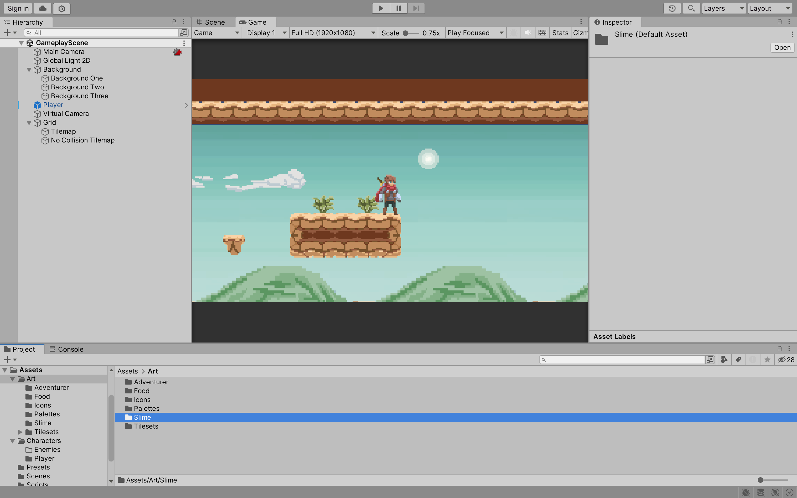

2. The component configuration is similar to the player. Implement the following:
    - Create a new empty object and name it **Slime**.
    - Add a **Sprite Renderer** component and set the **Sprite** to **slide-idle-0**.
    - Add a **Rigidbody 2D** component and set the **Gravity Scale** to **1**.
    - Add a **Capsule Collider 2D** component and edit the collider to fit the sprite.
    - Add a new **Script** component and name it **SlimeController**. We will add code to this soon.
    - Add the **TouchController** script to the **Slime** object.
    - Add an **Animator** component and create a new **Animation Controller** called **SlimeAnimationController**.

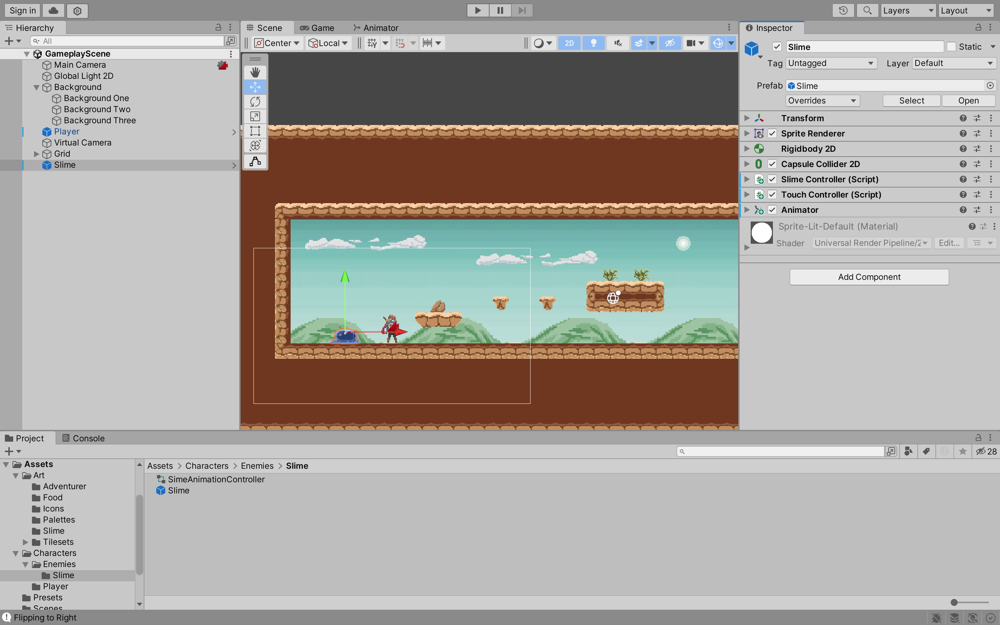

3. In the **Animator** window, create three new parameters:
    - **isGrounded** of type **Bool**.
    - **isOnWall** of type **Bool**.
    - **isOnCeiling** of type **Bool**.

Notice these parameters are similar to the player. 

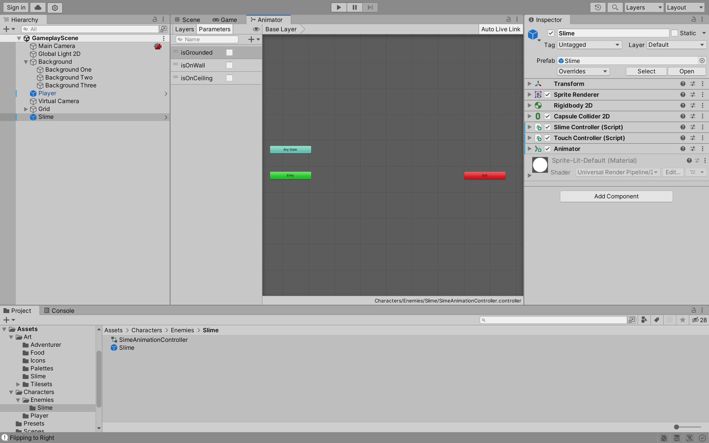

4. In the **SlimeController** script, implement the following code:

```csharp
using System.Collections;
using System.Collections.Generic;
using UnityEngine;

[RequireComponent(typeof(Rigidbody2D), typeof(TouchController))]
public class SlimeController : MonoBehaviour
{
    // Determine the direction the slime is walking
    public enum WalkableDirection
    {
        Right,
        Left
    }

    Rigidbody2D rb;
    Animator anim;
    TouchController touchController;

    public float walkSpeed = 3f;

    // The current direction the slime is walking
    [SerializeField]
    private WalkableDirection _walkableDirection = WalkableDirection.Right;

    // Represent the direction the slime is walking
    [SerializeField]
    private Vector2 _walkableDirectionVector;

    public WalkableDirection WalkDirection
    {
        get { return _walkableDirection; }

        // Flip the sprite to face the direction the slime is walking
        set { 
            if (_walkableDirection != value) 
            {
                gameObject.transform.localScale = new Vector2(gameObject.transform.localScale.x * -1, gameObject.transform.localScale.y);

                if (value == WalkableDirection.Left)
                {
                    _walkableDirectionVector = Vector2.left;
                }
                else if (value == WalkableDirection.Right)
                {
                    _walkableDirectionVector = Vector2.right;
                }
            }
            _walkableDirection = value;
         }
    }

    private void Awake()
    {
        rb = GetComponent<Rigidbody2D>();
        anim = GetComponent<Animator>();
        touchController = GetComponent<TouchController>();
    }

    // Start is called before the first frame update
    void Start() {}

    // Update is called once per frame
    void Update() {}

    private void FixedUpdate() 
    {
        // If the slime is grounded and on a wall, flip the direction
        if(touchController.IsGrounded && touchController.IsOnWall)
        {
            FlipDirection();
        }

        rb.velocity = new Vector2(walkSpeed * _walkableDirectionVector.x, rb.velocity.y);
    }

    private void FlipDirection()
    {
        if (WalkDirection == WalkableDirection.Left)
        {
            WalkDirection = WalkableDirection.Right;
        }
        else if (WalkDirection == WalkableDirection.Right)
        {
            WalkDirection = WalkableDirection.Left;
        }
        else 
        {
            Debug.LogError("Invalid WalkableDirection");
        }
    }
}
```

5. In the **Tilemap >Inspector** window, click on **Add Layer...** and add the following layers:
    - **Ground**
    - **Player**
    - **PlayerHitbox**
    - **Enemy**
    - **EnemyHitbox**


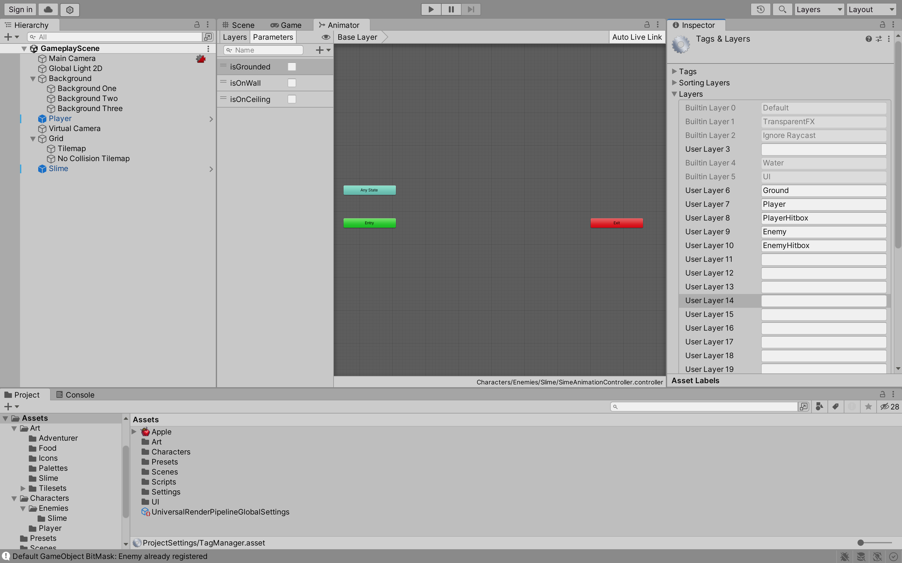

6. Set the **Tilemap** layer to **Ground**.

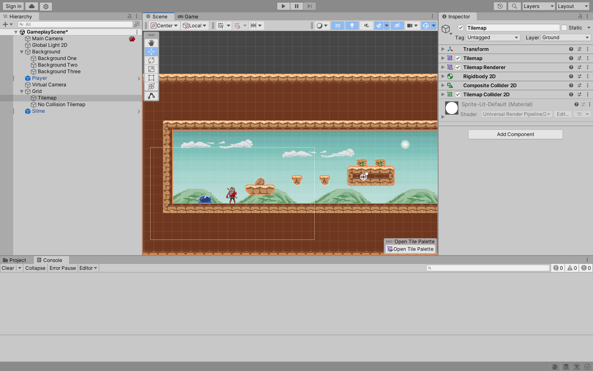

7. Set the **Slime** layer to **Enemy**. Also, in the **TouchController** script, set the **Use Layer Mask** to **true** and set the **Layer Mask** to **Ground**. Also, do the same for the **Player** object except set the layer to **Player**.

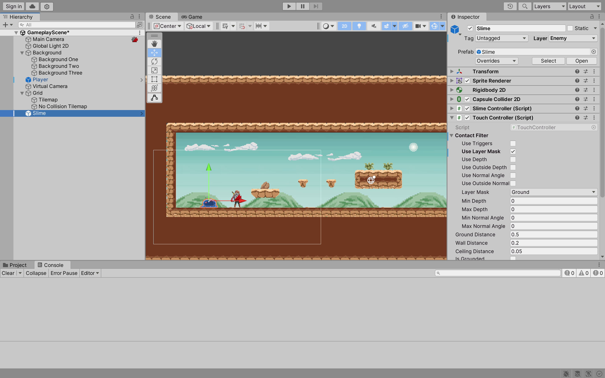

8. Go to **Edit > Project Settings... > Physics 2D**. Set the matrix to the following:

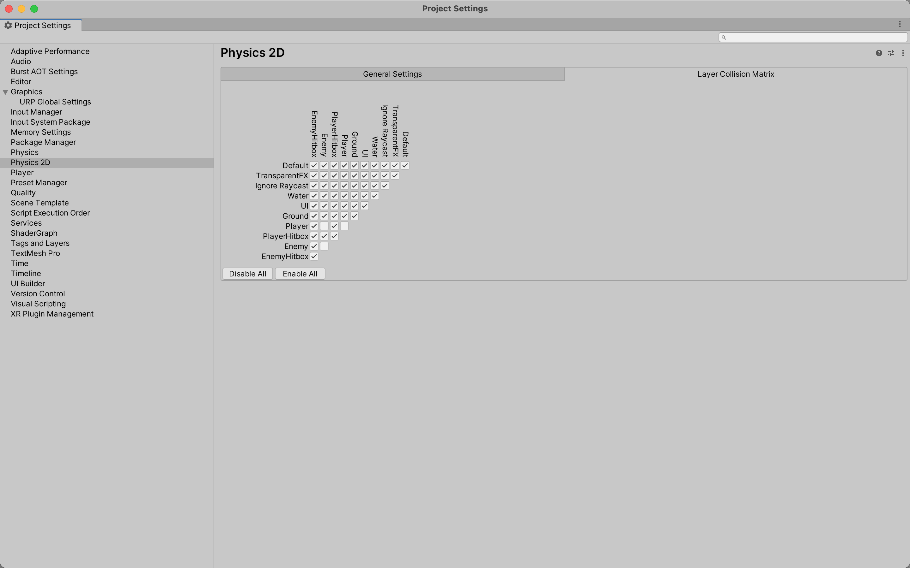

## Enemy Animation

1. In the **Animation** window, create the following animations:
    - **SlimeMoveAnimation**
    - **SlimeAttackAnimation**
    - **SlimeHurtAnimation**
    - **SlimeDieAnimation**

2. Uncheck the **Loop Time** option for the **SlimeAttackAnimation**, **SlimeHurtAnimation** and **SlimeDieAnimation**.

3. Create two new **Sub-State Machine** called **MoveStates** and **AttackStates**. Move the **SlimeMoveAnimation** to the **MoveStates** and the **SlimeAttackAnimation** to the **AttackStates**. 

4. Make the following transitions:
    - **MoveStates** to **AttackStates**. Add the **hasTarget** parameter in the **Conditions**. Set the **hasTarget** to **true**.
    - **AttackStates** to **MoveStates**. Add the **hasTarget** parameter in the **Conditions**. Set the **hasTarget** to **false**.
    - **MoveStates > SlimeMoveAnimation** to **Exit**. Set **Has Exit Time** to **false** and **Transition Duration (s)** to **0**.
    - **AttackStates > SlimeAttackAnimation** to **Exit**. Set **Exit Time** to **1** and **Transition Duration (s)** to **0**.

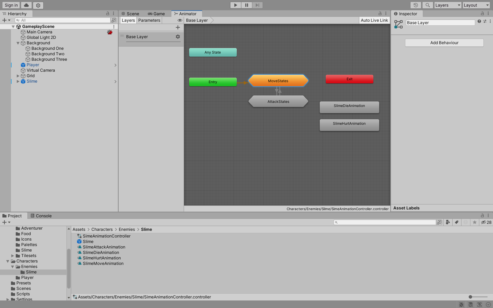

5. Create two new **Parameters** called **canMove** and **hasTarget** of type **Bool**. Set the **Default** value of **canMove** to **true**. Add the **SetBoolBehaviour** **Script** to **AttackStates**, **SlimeDieAnimation** and **SlimeHurtAnimation**. Set the **Parameter** to **canMove**. For **AttackStates**, set the **Update On State Machine** to **true**. For **SlimeDieAnimation** and **SlimeHurtAnimation**, set the **Update On State** to **true**. **Value On Exit** should be set to **true** for all of them.

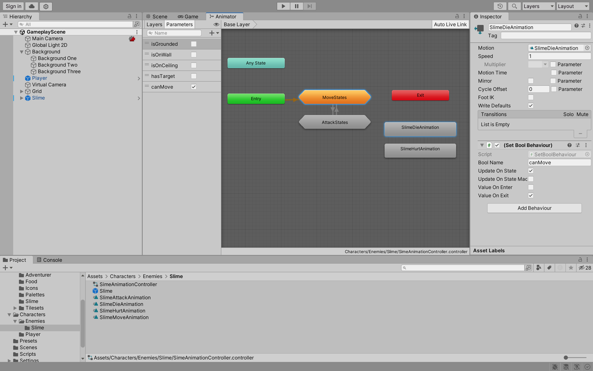

6. Go to **Edit > Project Settings... > Physics 2D**. Set the matrix to the following:


7. In the **Slime** object, create an empty object and name it **DetectionZone**. Add a **Box Collider 2D** component.

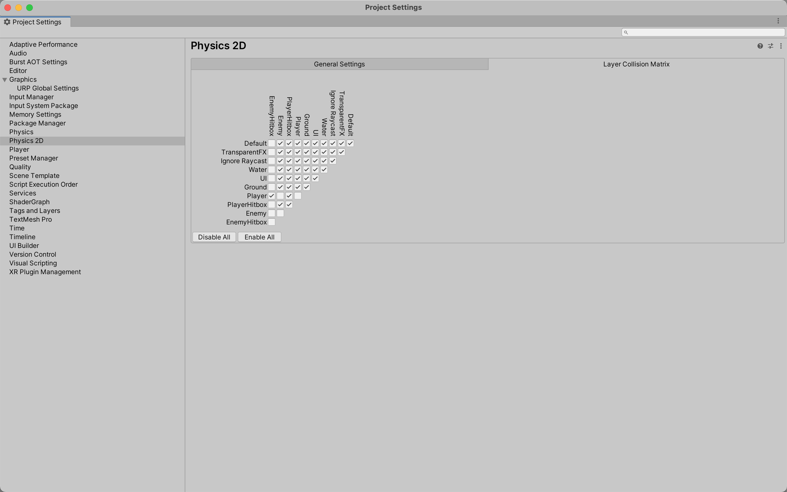

8. Add a new **Script** component and name it **DetectionZoneController**. Implement the following code:

```cs
using System.Collections;
using System.Collections.Generic;
using UnityEngine;

public class DetectionZoneController : MonoBehaviour
{
    public List<Collider2D> colliders = new List<Collider2D>();

    Collider2D collider;

    // Start is called before the first frame update
    void Start() {}

    // Update is called once per frame
    void Update() {}

    private void Awake()
    {
        collider = GetComponent<Collider2D>();
    }

    private void OnTriggerEnter2D(Collider2D collision)
    {
        colliders.Add(collision);
    }

    private void OnTriggerExit2D(Collider2D collision)
    {
        colliders.Remove(collision);
    }
}
```

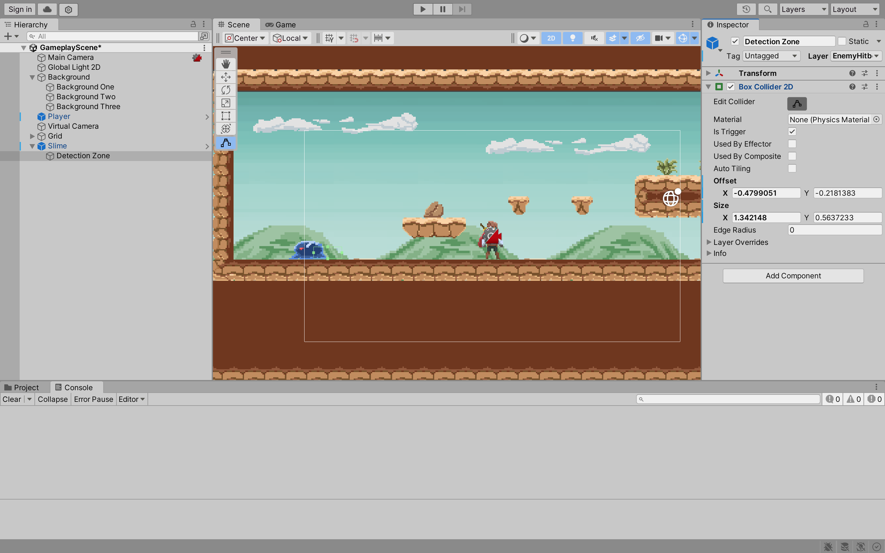

9. In the **SlimeController** script, implement the following code:

```cs
using System.Collections;
using System.Collections.Generic;
using UnityEngine;

[RequireComponent(typeof(Rigidbody2D), typeof(TouchController))]
public class SlimeController : MonoBehaviour
{
    // ...
    public DetectionZoneController detectionZone;

    // ...
    private bool _hasTarget;

    // ...

    public bool HasTarget
    {
        get { return _hasTarget; }
        set 
        { 
            _hasTarget = value; 
            anim.SetBool("hasTarget", value);
        }
    }

    // ...

    // Update is called once per frame
    void Update() 
    {
        HasTarget = detectionZone.colliders.Count > 0; // If the detection zone has a collider, set hasTarget to true
    }

    // ...
}
```

10. In the **Slime > Slime Controller**, set the **Detection Zone** to the **Detection Zone** object.

11. In the **SlimeController** script, implement the following code:

```cs
using System.Collections;
using System.Collections.Generic;
using UnityEngine;

[RequireComponent(typeof(Rigidbody2D), typeof(TouchController))]
public class SlimeController : MonoBehaviour
{
    // ...
    public float walkStopRate = 0.05f; // The rate at which the slime stops walking. You should experiment with this value
    // ...

    public bool CanMove 
    {
        get { return anim.GetBool("canMove"); }
    }

    // ...

    private void FixedUpdate() 
    {
        if(touchController.IsGrounded && touchController.IsOnWall)
        {
            FlipDirection();
        }

        if (CanMove)
        {
            rb.velocity = new Vector2(walkSpeed * _walkableDirectionVector.x, rb.velocity.y);
        }
        else 
        {
            // Slowly stop the slime from walking
            rb.velocity = new Vector2(Mathf.Lerp(rb.velocity.x, 0, walkStopRate), rb.velocity.y);
        }
    }

    // ...
}
```